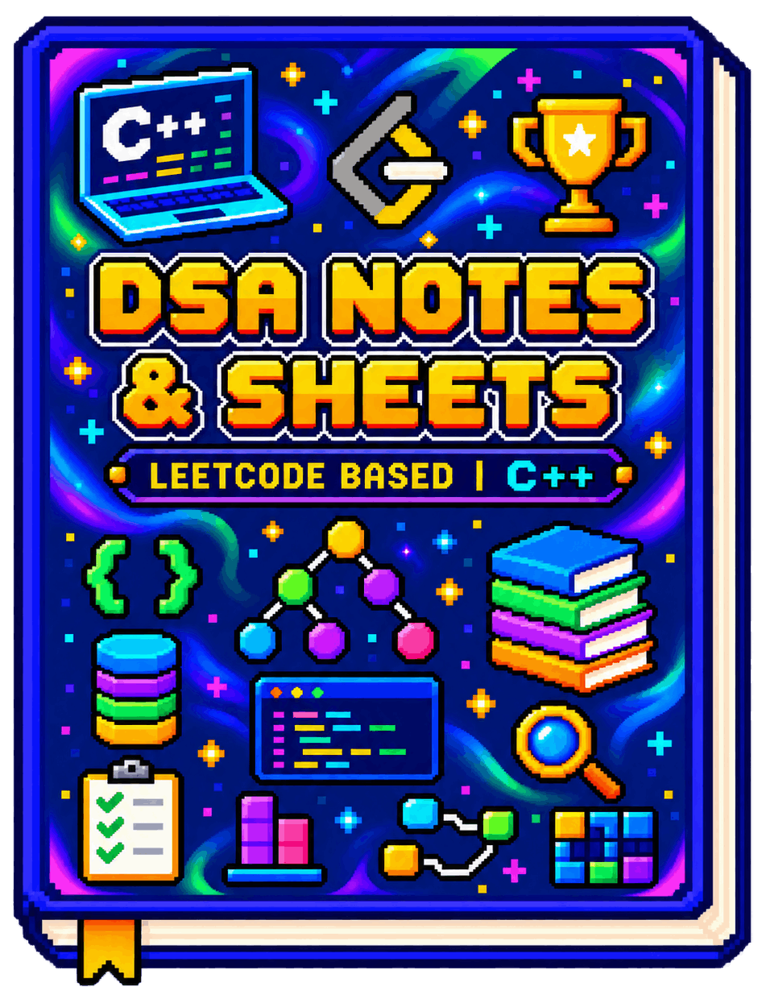

# DSA Notes & Sheets

<p align="center">
  
</p>

A battle-tested DSA handbook distilled from **1,000+ LeetCode problems**, unifying the best of **Striver's SDE Sheet**, **NeetCode 150**, and actual interview patterns from top Indian and global tech giants.

<p align="center">
  <a href="https://dummy-dsa.vercel.app">
    <button><strong>OPEN DIGITAL BOOK</strong></button>
  </a>
</p>

<p align="center">
  <strong>OR</strong>
</p>

<p align="center">
  <a href="docs/index.md"><button>Index</button></a>
  &nbsp;&nbsp;
  <a href="docs/problems.md"><button>Problem Sheet</button></a>
  &nbsp;&nbsp;
  <a href="docs/cheatsheet.md"><button>Cheat Sheet</button></a>
</p>

## Highlights

- **1,000+ Problem Invariants**: No textbook fluff. Focuses on invariant recognition, boundary condition handling, and optimal time-space trade-offs.
- **The Tri-Sheet Synthesis**: 150 high-yield interview problems cross-curated from Striver, NeetCode, and recurring question sets from top Indian product and service firms (Amazon, Google, Microsoft, Flipkart, Paytm, Zoho, TCS, Infosys).
- **34 Chapters | 30-Day Blueprint**: A rigorous trajectory from algorithmic fundamentals to advanced dynamic programming, segment trees, and graph theory.
- **Instant Reference Cheat Sheet**: High-density asymptotic bounds, standard algorithms, and modern C++ templates on a single page.
- **Zero-Build Web Reader**: Pure client-side Markdown, KaTeX math, Prism syntax highlighting, and local progress tracking out of the box.

## The 30-Minute Rule

> **Never stare at a blank editor for an hour.**
> - **0–20 min**: Break down constraints, draw state spaces, and trace edge cases.
> - **20–30 min**: If blocked, review the solution notes to identify the core invariant.
> - **Post-30 min**: Close the solution and write the clean C++ implementation independently.

## Run Locally

```bash
# Node
npx serve .

# Python
python -m http.server 8000
```

Open `http://localhost:3000` (or `http://localhost:8000`) in any browser.

## Project Structure

```text
dsa-notes/
├── index.html          # Interactive SPA web reader & problem tracker
├── assets/
│   ├── images/         # Cover illustration and static assets
│   ├── scripts/        # Client-side router, KaTeX engine & tracker logic
│   └── styles/         # Dark/light theme styles and tracker UI
└── docs/
    ├── index.md        # Chapter directory and topic index
    ├── cheatsheet.md   # Single-file master reference & C++ templates
    ├── problems.md     # 150-problem sheet categorized by pattern & company
    ├── problems.json   # Structured problem dataset for tracker filtering
    ├── chapters/       # 34 detailed chapter markdown notes
    └── solutions/      # LeetCode problem solution breakdowns
```
